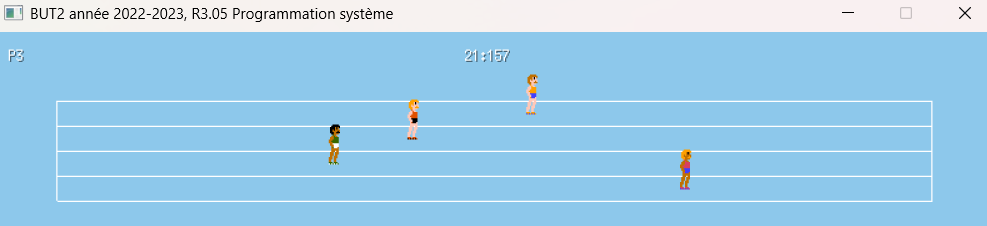

# Multiplayer Run Game

A Go-based project for managing and running multiplayer games, including server and client components.



## Features

- Game logic and updates ([game.go](game.go), [game-update.go](game-update.go), [game-layout.go](game-layout.go), [game-draw.go](game-draw.go))
- Course and field management ([course/](course/), [field.go](field.go))
- Runner and server utilities ([runner.go](runner.go), [serverRunner.go](serverRunner.go), [assets/runner.go](assets/runner.go))
- Server implementation ([server-go/server.go](server-go/server.go))
- Utility functions ([util.go](util.go))

## Installation

1. Clone the repository:
    ```sh
    git clone https://github.com/nonocro/run-game.git
    cd run-game
    ```
2. Install dependencies:
    ```sh
    go mod tidy
    ```
3. Build the project:
    ```sh
    go build
    ```

## Usage

To run the server:
```sh
go run server-go/server.go
```
or
```sh
go build server-go/server.go
.\server-go\server.exe
```

To run the client:
```sh
go build
.\course.exe <<your-server-ip>>
```